# Budgeting app

### Category circle

### Categories page
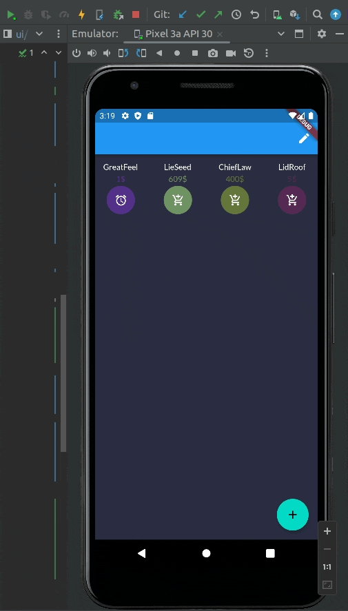

### Category create
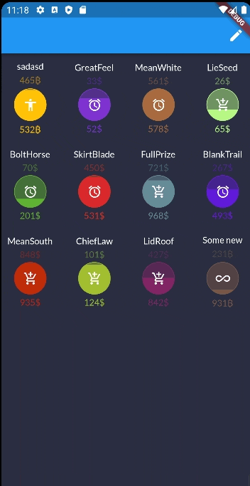

### Drag & drop
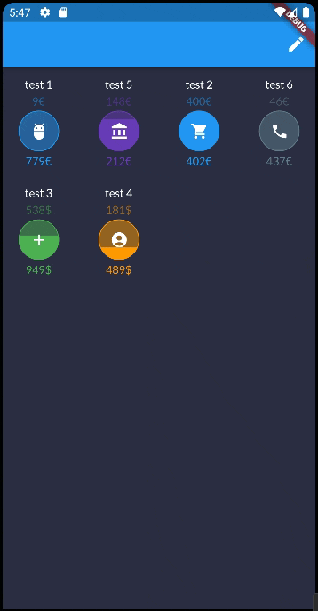

### Bottom naviagation
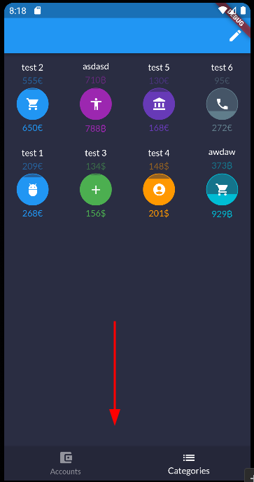

### Account create
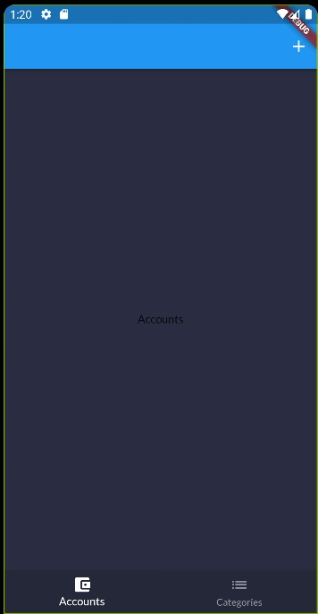

### Numpad
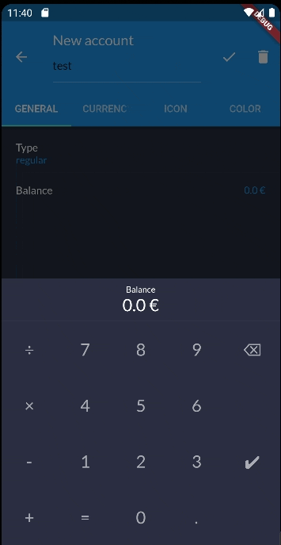

### Transaction create
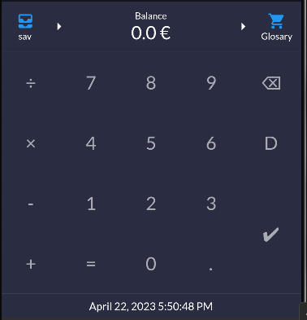

### Transaction numpad update
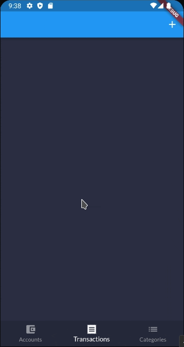

### Transaction list

### Budget page
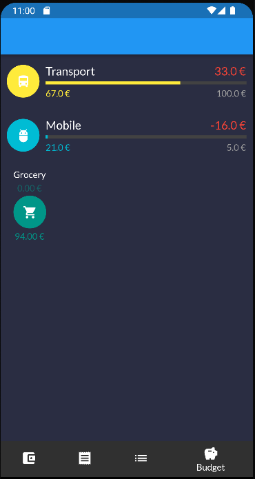

### Home screen widget

### Date bar
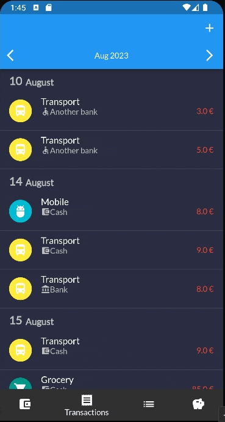

### Date Range
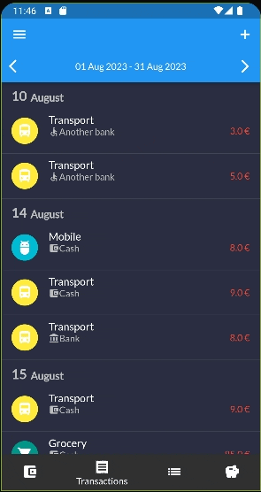

### Subcategories
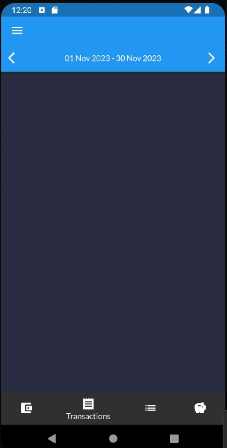

### New category editor
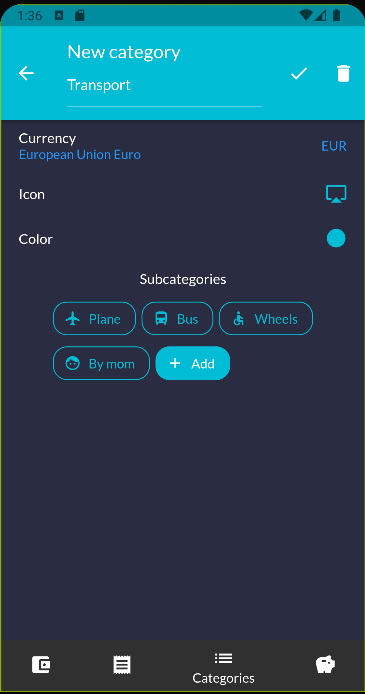

### New account editor
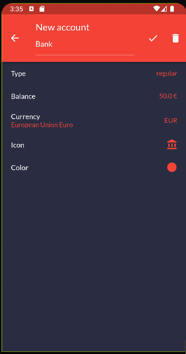